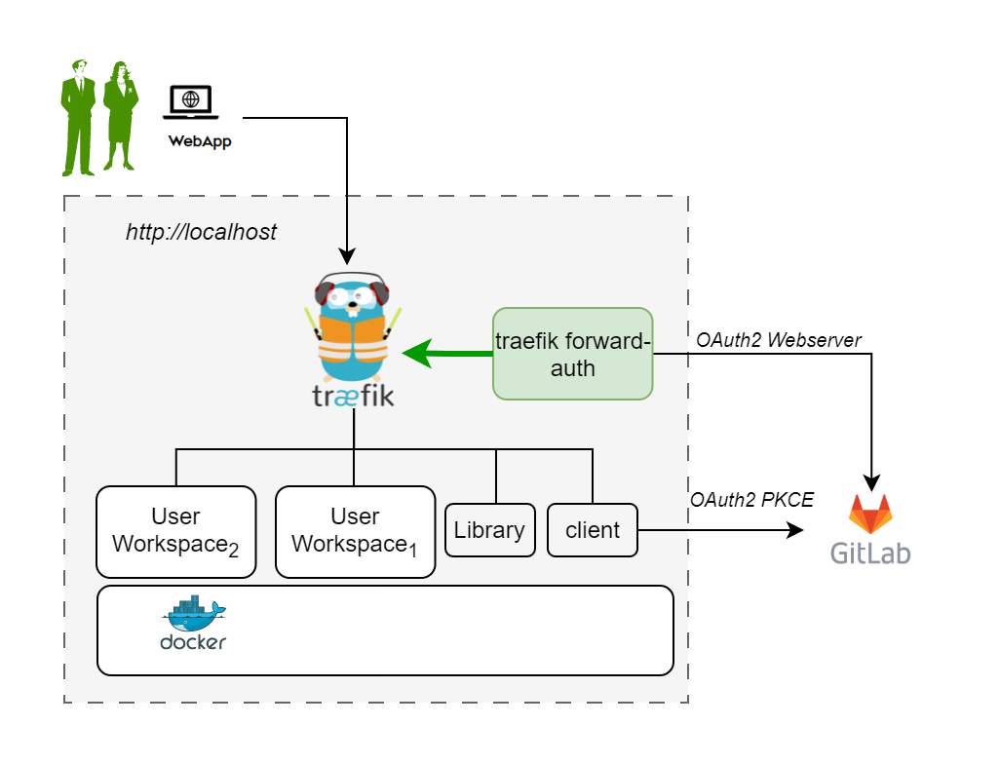

# Docker workflow for DTaaS

Use of docker images is handy for developers. It is suggested
that developers build the required images locally on their computer and
use them for development purposes.

This readme will explain the building and use of different docker files
for development purposes.

## Design

The docker compose environment creates the following development scenario.



## Folder Structure

There are two dockerfiles for building the containers:

- **client.dockerfile**: Dockerfile for building
  the client application container.
- **client.built.dockerfile**: Dockerfile for copying
  an already built client application into docker image.
  This dockerfile copies `client/build` directory and serves it from
  inside the docker container.
- **libms.dockerfile**: Dockerfile for building the library
  microservice container from source code.
- **libms.npm.dockerfile**: Dockerfile for building the library
  microservice container from published npm package at npmjs.com.
  This Dockerfile is only used during publishing. It is used neither
  in the development builds nor in Github actions.
- **compose.dev.yml:** Docker Compose configuration for
  development environment.
- **.env**: environment variables for docker compose file
- **conf.dev** OAuth2 configuration required by
  the Traefik forward-auth service

## Requirements

The installation requirements to run this development version of
the DTaaS are:

- docker with compose plugin
- User account on a gitlab instance (could be _gitlab.com_)
- OAuth2 application registrations

### OAuth2 Application Registration

The development docker setup requires dedicated authorization
setup for both frontend website and backend services.
Both these authorization requirements are satisfied
using OAuth2 protocol.

- The frontend website is a React single page application (SPA).
- The details of Oauth2 app for the frontend website are in
  [client docs](../docs/admin/client/auth.md).
- The Oauth2 authorization for backend services is managed
  by [Traefik forward-auth](https://github.com/thomseddon/traefik-forward-auth).
  The details of this authorization setup are in
  [server docs](../docs/admin/servers/auth.md).

It is necessary to register these two OAuth2 applications and
link them to your DTaaS development instance.

Please see
[gitlab oauth provider](https://docs.gitlab.com/ee/integration/oauth_provider.html)
documentation for further help with creating these two OAuth applications.

## Configuration

The configuration files to be updated are:

1. docker/.env
   please see [docker README](../deploy/docker/DOCKER-ENV.md) for help
   with updating this config file)
1. docker/conf.dev
   please see [server docs](../docs/admin/servers/auth.md) for help
   with updating this config file)
1. client/config/local.js
   please see [client config](../docs/admin/client/config.md) for help
   with updating this config file)

*note*: username(s) in `.env`, must be equal traefic used in `conf.dev` for `onlyu*`.

## Development Environment

:warning: There is a problem compiling client (`yarn build`) inside
docker container. Hence, it is required to copy the built
files into the docker container. The docker compose build
command fails if `client/build` directory does not exist.

The development environment requires docker images to be built
become the docker compose application can be brought up.

The images can be built using

```sh
docker compose -f compose.dev.yml build
```

The first build requires download of base docker images and building
requires docker image layers.
It does take time but the subsequent builds will happen quickly.

### Running Docker Containers

The docker commands need to be executed from this directory(`docker`).
The relevant docker commands are:

```bash
docker compose -f compose.dev.yml up -d #start the application
docker compose -f compose.dev.yml down  #terminate the application
```

### Access the Application

The application will be accessible at:
<http://localhost> from web browser.
Sign in using your gitlab.com account.

All the functionality of DTaaS should be available to you
through the single page client now.

## Publish Docker Images

Build and publish the docker images. This step is required only for
the publication of images to Docker Hub.

:stop_sign: This publishing step is managed
only by project maintainers. Regular developers can skip this step.

The DTaaS development team publishes reusable packages which are then
put together to form the complete DTaaS application.

The packages are published on
[github](https://github.com/orgs/INTO-CPS-Association/packages?repo_name=DTaaS),
[npmjs](https://www.npmjs.com/org/into-cps-association), and
[docker hub](https://hub.docker.com/u/intocps) repositories.

The packages on
[github](https://github.com/orgs/INTO-CPS-Association/packages?repo_name=DTaaS)
are published more frequently but are not user tested.
The packages on [npmjs](https://www.npmjs.com/org/into-cps-association)
and [docker hub](https://hub.docker.com/u/intocps)
are published at least once per release.
The regular users are encouraged to use the packages from npm and docker.

A brief explanation of the packages is given below.

| Package Name | Description | Documentation for | Availability |
|:----|:----|:----|:----|
| dtaas-web | React web application | [container image](../docs/admin/client/docker.md) | [docker hub](https://hub.docker.com/r/intocps/dtaas-web) and [github](https://github.com/INTO-CPS-Association/DTaaS/pkgs/container/dtaas-web) |
| libms |Library microservice | [npm package](../docs/admin/servers/lib/npm.md) | [npmjs](https://www.npmjs.com/package/@into-cps-association/libms) and [github](https://github.com/INTO-CPS-Association/DTaaS/pkgs/npm/libms) |
| | | [container image](../docs/admin/servers/lib/docker.md) | [docker hub](https://hub.docker.com/r/intocps/libms) and [github](https://github.com/INTO-CPS-Association/DTaaS/pkgs/container/libms) |
| runner | REST API wrapper for multiple scripts/programs | [npm package](../docs/user/servers/execution/runner/README.md) | [npmjs](https://www.npmjs.com/package/@into-cps-association/runner) and [github](https://github.com/INTO-CPS-Association/DTaaS/pkgs/npm/runner) |
| ml-workspace-minimal (fork of [ml-workspace](https://github.com/ml-tooling/ml-workspace)) | User workspace | not available | [docker hub](https://hub.docker.com/r/intocps/ml-workspace-minimal/tags). Please note that this package is **highly experimental** and only v0.15.0-b2 is usable now. |

### React Website

```sh
docker build -t intocps/dtaas-web:latest -f ./docker/client.built.dockerfile .
docker tag intocps/dtaas-web:latest intocps/dtaas-web:<version>
docker push intocps/dtaas-web:latest
docker push intocps/dtaas-web:<version>
```

To tag version **0.3.1** for example, use

```sh
docker tag intocps/dtaas-web:latest intocps/dtaas-web:0.3.1
```

To test the react website container on localhost, please use

```bash
docker run -d \
  -v ${PWD}/client/config/local.js:/dtaas/client/build/env.js \
  -p 4000:4000 intocps/dtaas-web:latest
```

### Library Microservice

The Dockerfile of library microservice has `VERSION` argument.
This argument helps pick the right package version from <http://npmjs.com>.

```sh
docker login -u <username> -p <password>
docker build -t intocps/libms:latest -f ./docker/libms.npm.dockerfile .
docker push intocps/libms:latest
docker build --build-arg="VERSION=<version>" \
  -t intocps/libms:<version> -f ./docker/libms.npm.dockerfile .
docker push intocps/libms:<version>
```

To tag version 0.3.1 for example, use

```sh
docker build --build-arg="VERSION=0.3.1" \
  -t intocps/libms:0.3.1 -f ./docker/libms.npm.dockerfile .
```

To test the library microservice on localhost, please use

```bash
docker run -d -v ${PWD}/files:/dtaas/libms/files \
  -p 4001:4001 intocps/libms:latest
```